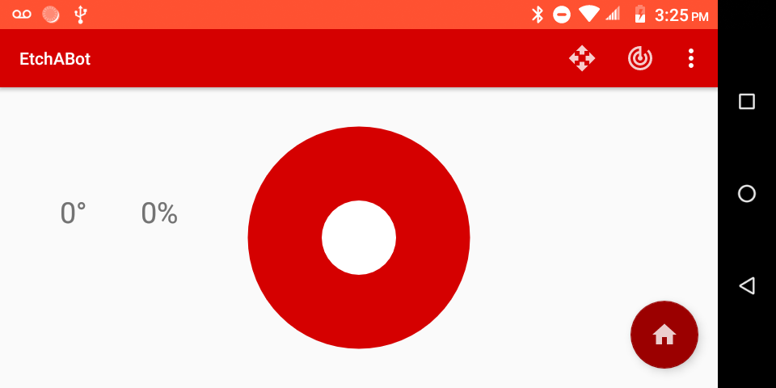
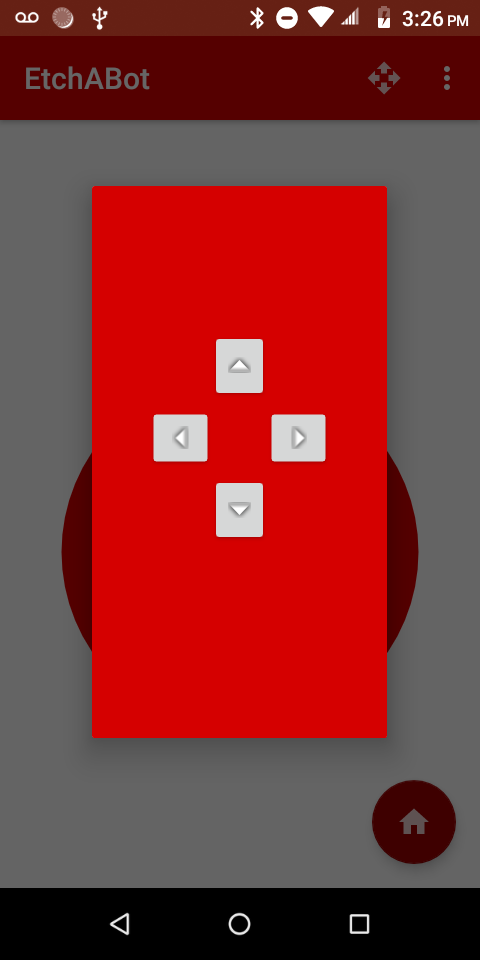

# EtchABot App

The purpose of this app is to function as a master to the Arduino slave. Therefore, it is entirely dependent on a Bluetooth 
connection. Instead of handling the Bluetooth connection in the app itself, I used a library called Ardutooth to handle all the bluetooth stuff (turning on Bluetooth, pairing, connecting, sockets, etc.)
externally. I contributed to this library the functionality to also read from the Arduino (which I found helpful during integration). Here's a link to that <a href="https://github.com/giuseppebrb/Ardutooth">project</a>.

As of this version, the app has four activities:

<ol>
<li>The Main Activity</li>
<li>The Spirograph Activity</li>
<li>The Microstep Activity</li>
<li>The About Activity</li>
</ol>

## Main Activity

The Main Activity is the first activity that is launched upon the app starting.

It has several elements:
<ul>
<li>A Joystick in the center</li>
<li>Two TextViews positioned over the Joystick</li>
<li>FAB</li>
<li>A Menu bar that has the buttons to the other Activites</li>
</ul>

 The Joystick View in the center was created by Damien Brun - <a href="https://github.com/controlwear/virtual-joystick-android">Link to his project</a>. 
The Joystick serves as the main control for the Etch-A-Sketch. If a user taps anywhere on the Joystick, or slides a finger
across it, the event handler takes the angle, and the distance from the center and creates a vector that can be sent to 
the Arduino over Bluetooth.

The TextViews show the angle and power of the current input via the Joystick.

The FAB, when clicked, sends a command to move the Etch-A-Sketch to 0,0 (home), and it shows a Snackbar that has a message,
"Auto Homing."

It has two layouts, one for portrait, one for landscape:

 

## Spirograph Activity

In the Spirograph Activity, a user can enter two numbers in the fields in the center of the page and press the Start button, and 
the app will use those two parameters in an algorithm. This algorithm generates a set of coordinates and sends the coordinates,
one-by-one to the Arduino, drawing a spirograph. The algorith and communication takes place in a background Service on a seperate
thread, so the user can start the spirograph and switch to a different app on the Android. The Service will stay alive as long 
as the app is, or until the user presses the Stop button. The user can also leave the two fields blank, and the app will randomly 
generate two parameters.

The algorithm was taken from <a href="https://github.com/geekmomprojects/EtchABot/blob/master/examples/EtchABotPatterns/EtchABotPatterns.ino">this</a> 
part of Debra Ansell's project.

There is also a FAB which is identical to the FAB on the Main Activity.

Here's a screenshot of the activity:

And here's a gif of the spirograph drawing:

## Microstep Activity

The Microstep Activity is a dialog activity that appears over the Main Activity. It has four arrow buttons pointing up,
down, left, and right, respectively. When pressed, each button will send a command to move the Etch-A-Sketch a small amount
in that direction.

## About Acivity

A simple dialog with a link to this GitHub project:

