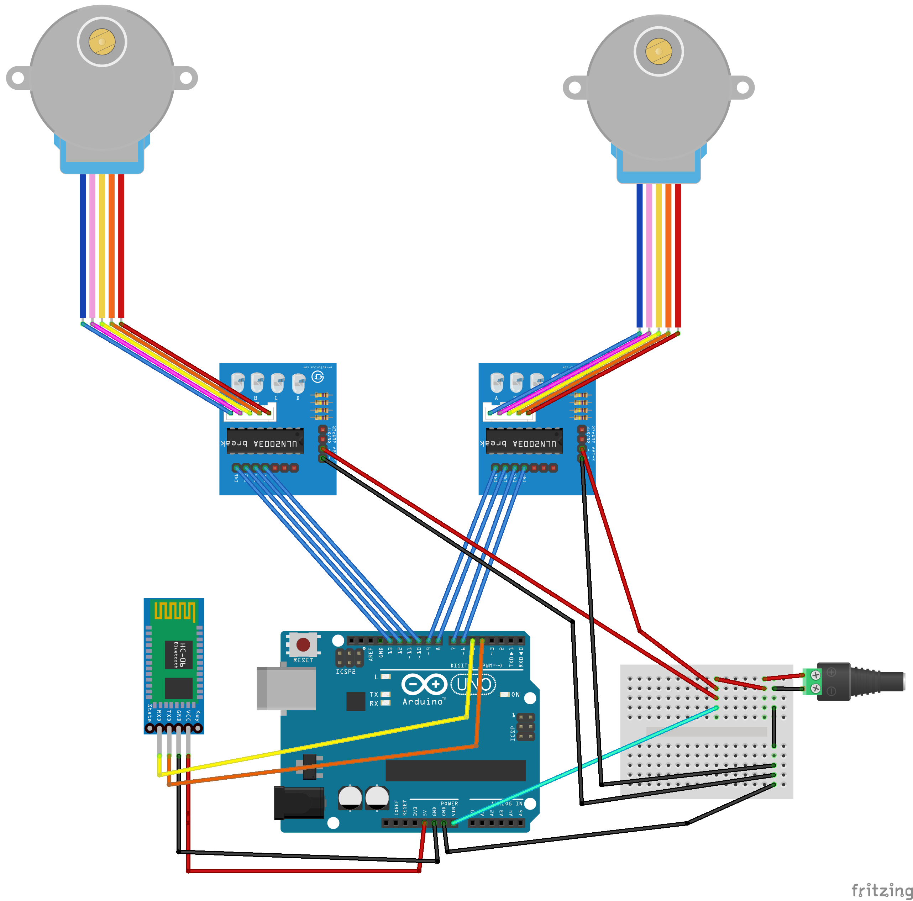
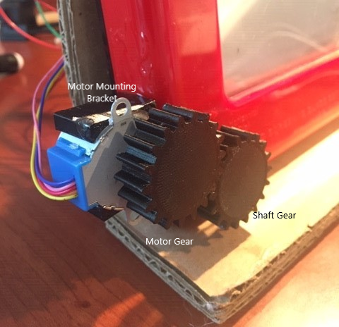

# EtchABot

<h5>Final Project for Android Class. Controls an Etch-A-Sketch from Android App</h5>
 

  The main idea of this project was to control an Etch-A-Sketch using stepper-motors and an Arduino Uno, and then send 
  instructions to the Arduino from an Android app via Bluetooth.  
  
  
  There are three parts to this project:
  <ol>
  <li>The hardware/wiring</li>
  <li>The Arduino software</li>
  <li>The Android app</li> 
  </ol>
  
  The wiring of the electrics, some of the code (especially the Arduino code), and the project's name was 
  inspired by/is a modified version of a project by Debra Ansell (GeekMomProjects). Here's a link to that project: https://github.com/geekmomprojects/EtchABot        
 

 
## Hardware
 

 I used the following hardware components:
 <ul>
 <li>1 Etch-A-Sketch (classic size)</li>
 <li>1 Arduino Uno microcontroller</li>
 <li>2 28BYJ-48 stepper motors</li>
 <li>2 ULN2003 stepper motor driver boards</li>
 <li>1 HC-06 Bluetooth module</li>
 <li>1 Mini-breadboard</li>
 <li>1 DC barrel jack adapter (breadboard compatible)</li>
 <li>1 6V DC power adapter</li>
 <li>A bunch of male-to-male and female-to-male jumper wires</li>
 </ul>
 See the following wiring diagram for how I connected all the components. 
 

 
 
 
 
Note: The Arduino's vcc pin is connected to the same 6V DC power adapter as the rest of the circuit (the cyan wire).
 When writing to the Arduino, or running the Arduino off of the USB input, it's important to <b>disconnect</b> this pin.
 Otherwise, the motors can pull too much power through the Arduino and burn it out.
 
 I tried coupling the motor shaft to the shaft of the Etch-A-Sketch directly with a small flexible shaft coupler, but I
 found it difficult to center the coupler over the shaft so that everything spins concentrically. So instead, I 3D 
 printed some gears and mounting brackets for the motors. When I was happy with the placement of the motors, I 
 permanently epoxied them in place; I could have figured out a way to attach them mechanically with hardware, but it 
 seemed easier this way, and I was confident that I would not need to remove the motors in the future. The STL's for 
 the gears and the bracket are in the STL folder (I recommend the involute gears).
 

 
 
 
 
Finally, the Etch-A-Sketch and all of the electrical components are hot-glued to some pieces of cardbord that act as 
 a stand.

 
## Arduino Code

 
 The code for the Arduino is pretty simple (albeit a bit of spaghetti code). After initializing the motors and the Software
 Serial that represents the Bluetooth, it waits until a command string is recieved by the Bluetooth module. After reading a 
 semicolon (which marks the end of a command string) it interprets and executes the command. Upon the completion of execution 
 of the command, it will resume reading off of the Bluetooth module. 
 
 The library for the motors is the AccelStepper library by Mike McCauley, which can run two (or more) motors simultaneously, 
 and tracks the position in steps of the motors.
 

 
 ## Android app
 

 There's much more going on in the Android app than the other parts of the project so here's a link to its own <a href="EtchABot/README.md"> README</a>
 

